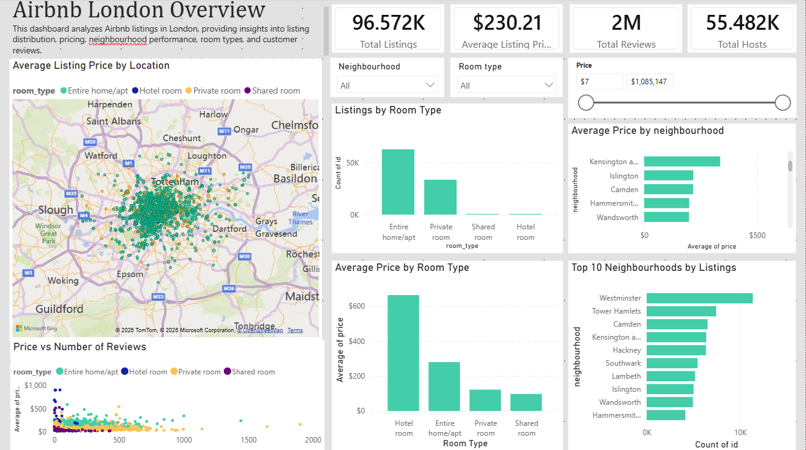

# Airbnb London Market Analysis Dashboard

## Project Overview

This project presents an interactive Power BI dashboard built using the Airbnb London dataset. The dashboard helps analyze listing prices, room types, neighbourhood distribution, reviews, and host statistics through interactive visualizations.

## Dashboard Features

- KPI Cards
  - Total Listings
  - Average Listing Price
  - Total Reviews
  - Total Hosts
- Interactive Map showing listing locations
- Average Listing Price by Neighbourhood
- Average Listing Price by Room Type
- Listings Distribution by Room Type
- Top 10 Neighbourhoods by Number of Listings
- Price vs Number of Reviews (Scatter Plot)
- Interactive Filters (Room Type, Neighbourhood, Price Range)

## Tools & Skills

- Microsoft Power BI
- Power Query
- Data Modeling
- Data Visualization
- Interactive Dashboards

## Dataset

Airbnb London Listings Dataset

## Dashboard Preview

## Files

- `Airbnb_London.pbix` – Power BI project
- `Airbnb_London_Report.pdf` – Dashboard report
- `dashboard.png` – Dashboard preview
